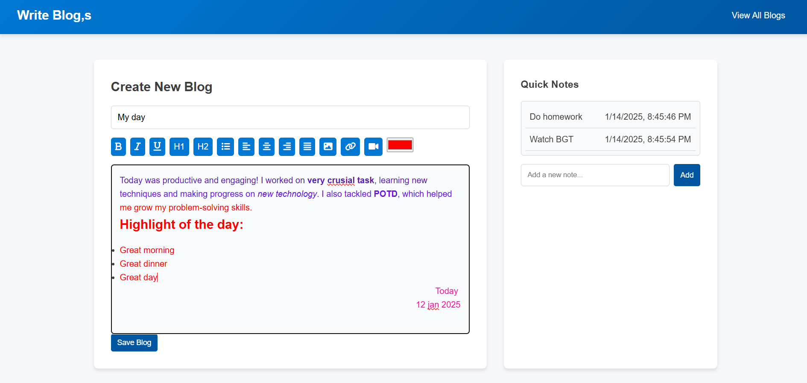

# Blog-Website:

## 1️⃣ Introduction
An blogging platform allows users to develop, edit, and manage blogs with ease. The interface is also clean and easy to understand with a built-in text editor for rich formatting as well as save quick notes features.

---

## 2️⃣ Features

### Core Features:
1. **Rich Text Editor:**
   -Make a blog with all the formatting options for bold, italics, underline, headings, lists, text alignment, and many other features.
- Insert images, videos, and links with ease.
- Change font color using a color picker.

2. **Blog Management:**
   - Save blogs locally in the browser's `localStorage`.
- All saved blogs are viewable on a page of blogs.
- Edit or delete previously saved blogs.

3. **Quick Notes:**
Add and manage quick notes.
Save notes locally with timestamps for easy reference.

### Bonus Features:
- Responsive design for smooth use on mobile, tablet, and desktop devices.
- Save capability for blogs being edited (using `localStorage`).
- User-friendly interface.
- Insert images, videos, and links with ease.
- Change font color using a color picker.

---
## 3️⃣ How to Use
### 1. **New Blog**
   - Go to the home page.
   - Enter a title for your blog in the title input field.
   - Use the text editor to compose your content with rich formatting options.
   - Click the **Save Blog** button to save the blog.
### 2. **Manage Blogs

- Go to the "View All Blogs" page to view your saved blogs.
   Use the **Edit** button to edit a blog or the **Delete** button to delete it.
### 3. **Quick Notes**

   Add a note in the quick notes section on the right-hand side.
   Notes are saved with timestamps for easy tracking.

### Screenshots:
#### Homepage:

#### Blog Listing:
Add blog listing screenshots to showcase how blogs are displayed.

---
## 4️⃣ Technical Details
### Technologies Used:

1. **HTML:** For the skeleton of the application.
2. **CSS:** For styling UI and responsiveness.
3. **JavaScript:**
   - Used for dynamic interactivity and functionalities.
   - Handling local storage for blogs and notes.
   - Implementing text formatting commands and user prompts.
---
## 5️⃣ Future Enhancements

1. **User Authentication:**

- Implement ability to log in and view your blogs securely from any device.
2. **Cloud Storage:**

   Store blogs and notes in a cloud database for easy synchronization.
3. **Tagging and Categories:**

   Allow users to tag their blogs and categorize them so that they are easy to view.

